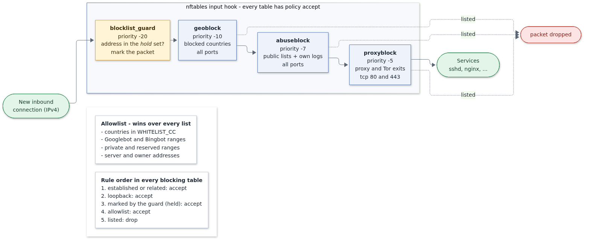
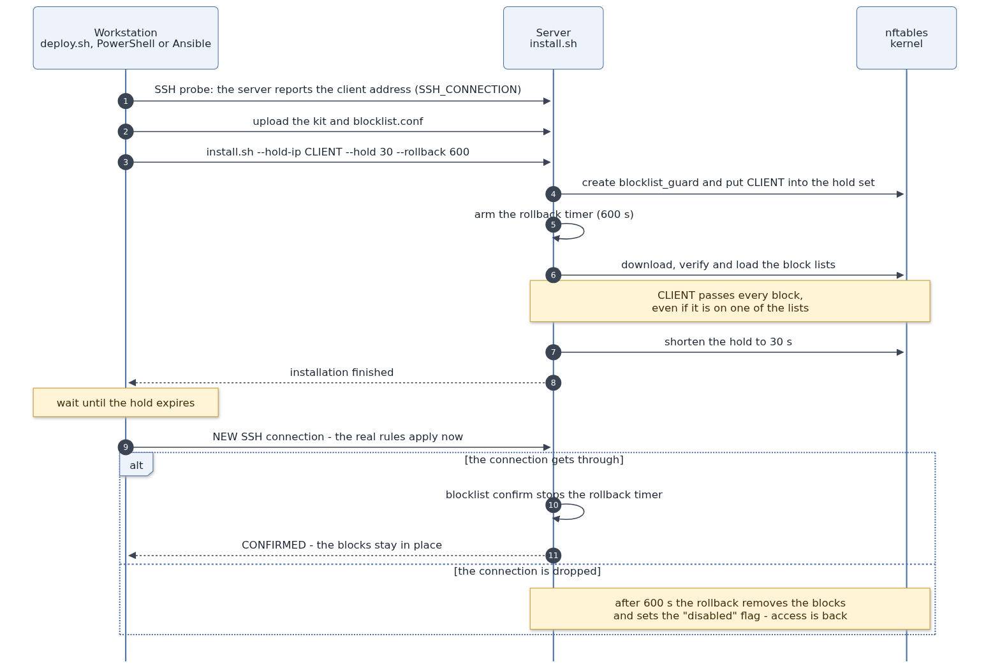
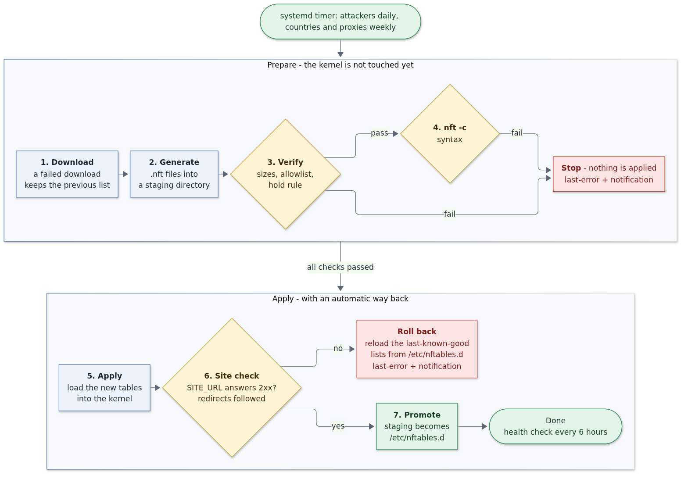

# blocklist-active

nftables blocklists for Linux servers: country geoblocking, attacker lists and proxy/Tor.
Lists are verified before apply and rolled back automatically on failure. The installer
temporarily exempts its own IP, so you can't lock yourself out. Deploy via shell,
PowerShell, Ansible or a self-extracting `.run`. Tested on 14 distributions.

| Way to install | From | File |
|---|---|---|
| Shell script on the server | the server | `install.sh` |
| Over SSH from a workstation | Linux, macOS, WSL, Git Bash | `deploy/deploy.sh` |
| Over SSH from Windows | PowerShell 5.1+ | `deploy/Deploy-Blocklist.ps1` |
| Ansible | a control node | `ansible/site.yml` |
| A single self-extracting file | the server | `dist/blocklist-installer-<version>.run` (`build.sh`) |

All five end in the same state on the server.

---

## How it works



Every new inbound IPv4 connection passes four nftables tables on the input hook, in
priority order:

| Table | Priority | Blocks | Ports |
|---|---|---|---|
| `inet blocklist_guard` | -20 | nothing - it marks packets from held addresses | - |
| `inet geoblock` | -10 | countries from `COUNTRIES` | all |
| `inet abuseblock` | -7 | attackers: public lists + the server's own SSH and web logs | all |
| `inet proxyblock` | -5 | open proxies and Tor exits | tcp 80, 443 only |

- **Allowlist first.** Countries in `WHITELIST_CC`, Googlebot and Bingbot ranges (refreshed
  daily from the official JSON files), private ranges, and the server and owner addresses
  are never blocked. Without it a site falls out of search results (public lists do
  contain Bingbot addresses), and a server can end up blocking itself.
- **A filter, not a firewall.** Every table has `policy accept` and only drops what is listed.
  Other tables (Docker, firewalld, ufw) are never touched: there is no `flush ruleset`
  anywhere, and the tables are loaded by their own `blocklist.service`.
- **Proxy blocks stop at the web ports**, so a proxy list can never lock out SSH.
- **IPv4 only.** See [Limitations](#limitations).

## Installing without locking yourself out



1. The deploy tool asks the server which address it sees (`SSH_CONNECTION`).
2. `install.sh` puts that address into the `hold` set of `blocklist_guard`. The guard marks
   its packets and every blocking table accepts marked packets before its drop rule, so the
   address passes everything - even if it is on a list.
3. A rollback timer is armed (600 s by default).
4. When the installation finishes, the hold is shortened to 30 seconds.
5. The deploy tool waits for the hold to expire and opens a **new** SSH connection, now
   subject to the real rules. If it gets through, it runs `blocklist confirm`, which stops
   the rollback timer.
6. If the address is blocked, nothing else is needed: the rollback removes the blocks and
   sets a `disabled` flag that keeps them off across reboots until `blocklist enable`.

The existing SSH session never drops (established connections always pass). The hold
protects **new** connections during the installation, such as Ansible tasks or a second
SSH session. If the installer finds your address on a list, it prints a red warning; add
the address to `OWNER_IPS` or run with `--trust-hold-ip`.

## Safe list updates



`blocklist-update.sh` stops at the first problem:

1. **Download.** A list that fails to download keeps its previous version.
2. **Generate** the `.nft` files into `/var/lib/blocklist/staging`, never into the live files.
3. **Verify** with `verify-lists.py`: minimum sizes, no large drop compared with the current
   lists, nothing from the allowlist blocked, hold rule present before every drop rule.
4. **Syntax check** with `nft -c`.
5. **Apply** to the kernel.
6. **Site check.** `SITE_URL` must answer 2xx (redirects are followed). If not, the lists from
   `/etc/nftables.d` - the last ones that passed every step - are loaded back.
7. **Promote.** Only now do the new files replace `/etc/nftables.d`.

Every failure writes `/var/lib/blocklist/last-error`, shows up at the next SSH login and,
if configured, goes out through ntfy, Telegram or e-mail.

---

## Supported distributions

All 14 pass all 75 checks of `test/test.sh` (Docker containers with a real systemd):

| Family | Distributions |
|---|---|
| Debian / Ubuntu (apt) | Ubuntu 26.04, 24.04, 22.04 · Debian 13, 12 |
| RHEL (dnf) | AlmaLinux 10, 9 · Rocky Linux 9 · CentOS Stream 10 · Oracle Linux 9 · Fedora 44 · Amazon Linux 2023 |
| Others | openSUSE Leap 16 (zypper) · Arch Linux (pacman) |

Versions, details and proposals for further testing: [docs/DISTRIBUTIONS.md](docs/DISTRIBUTIONS.md).

Requirements: systemd, nftables and Python 3.7+ (both installed automatically), IPv4.
Not supported: Alpine and other distributions without systemd.

---

## Quick start

### 1. Configuration

```bash
mkdir -p configs && cp blocklist.conf.example configs/my-server.conf
```

Only `SITE_URL` really matters (leave it empty on a server without a website).
`SERVER_IPS` is detected automatically; behind NAT (AWS, GCP) add the public address.
The `configs/` directory is ignored by git.

### 2a. On the server

```bash
sudo ./install.sh --config configs/my-server.conf
```

Then, from a **new** SSH connection:

```bash
sudo blocklist confirm
```

### 2b. From Linux, macOS, WSL or Git Bash

```bash
deploy/deploy.sh -t root@server.example.com -c configs/my-server.conf
```

The confirmation from a new connection is automatic; `--no-confirm` leaves it to you.

### 2c. From Windows (PowerShell)

```powershell
.\deploy\Deploy-Blocklist.ps1 -Target root@server.example.com -Config .\configs\my-server.conf
```

Uses the built-in OpenSSH client and `tar.exe`; no bash needed.

If `seed/seed.tar.gz` exists (an accumulated proxy list and remembered attackers from an
earlier server), `deploy.sh` and the PowerShell script upload it, and it is used only where
the server has no such data yet.

### 2d. Ansible

```bash
cd ansible && cp inventory.example.ini inventory.ini && ansible-playbook site.yml
```

The configuration lives in the `blocklist_*` variables (see
`roles/blocklist/defaults/main.yml`). The role runs `install.sh` only when the kit or the
config changed, so a second run reports no changes. Python on the target is not a
prerequisite.

### 2e. Self-extracting file

```bash
./build.sh
```

```bash
scp dist/blocklist-installer-2.0.0.run root@server:/root/
```

```bash
sudo sh blocklist-installer-2.0.0.run --config my-server.conf
```

The payload is checked against a SHA-256 sum before extraction; `--extract DIR` only unpacks.

### `install.sh` options

| Option | Meaning |
|---|---|
| `--config FILE` | configuration (required the first time) |
| `--force-config` | overwrite an existing `/etc/blocklist.conf` |
| `--hold-ip IP` | address that passes during the installation (default: the SSH session) |
| `--hold SEC` | how long it still passes after the installation (30) |
| `--rollback SEC` / `--no-rollback` | safety net (600) |
| `--trust-hold-ip` | write the held addresses permanently into `OWNER_IPS` |
| `--no-bootstrap` | no download; local lists are used (`rebuild`) |
| `--no-packages` | do not install packages |
| `--no-backup` | no daily configuration snapshot |
| `--seed FILE` | initial data (`root/final`, `seen.txt`) |

---

## Daily use

| Command | What it does |
|---|---|
| `blocklist status` | tables, element counts, dropped packets, holds, rollback, last checks |
| `blocklist check IP...` | would the address be blocked, and by what |
| `blocklist hold IP [SEC]` | let an address through for a while (e.g. before working from a new place) |
| `blocklist release IP` | end a hold |
| `blocklist confirm` | confirm an installation (stop the rollback) |
| `blocklist disable [reason]` / `enable` | turn the blocks off / on (survives reboots) |
| `blocklist update geo\|abuse\|proxy\|all\|rebuild` | refresh the lists (`rebuild` = no download) |
| `blocklist notify` | send a test notification |
| `systemctl stop blocklist` | remove the blocks until the next start |

Your own attacker list: every `/root/geoip/abuse/l_*` file (one address or CIDR per line)
is merged at the next refresh or with `blocklist update rebuild`.

## Automation

| When | What | Unit |
|---|---|---|
| boot | load the tables from `/etc/nftables.d` | `blocklist.service` |
| daily 04:20 | attacker lists + search engine ranges | `blocklist-update@abuse.timer` |
| Sundays 04:40 | country zones | `blocklist-update@geo.timer` |
| Sundays 05:10 | proxy and Tor lists | `blocklist-update@proxy.timer` |
| every 6 h | kernel matches disk, site, SSH, certificate, list age | `blocklist-health.timer` |
| Mondays 03:30 | `certbot renew --dry-run` (only if certbot exists) | `certbot-canary.timer` |
| daily 03:10 | configuration snapshot, keeps 14 | `blocklist-backup.timer` |

Problems show up at SSH login (MOTD or `/etc/profile.d`), in `blocklist status`, in
`/var/lib/blocklist/*-error` and, when configured, through ntfy, Telegram or e-mail.

The certbot hooks remove the attacker and proxy tables during HTTP-01 validation
(Let's Encrypt does not publish its validator addresses) and restore them from
`/etc/nftables.d` afterwards, even when the renewal fails.

## List sources

| Group | Sources |
|---|---|
| Countries | ipdeny.com country zones |
| Attackers | FireHOL level 1-3, Spamhaus DROP/EDROP, DShield, blocklist.de, GreenSnow, CINS Army, Emerging Threats, ThreatFox (confidence 100), abusers / StopForumSpam / CleanTalk (30 days), optionally AbuseIPDB (confidence >= 90, needs a key) |
| Own logs | failed SSH logins and preauth probes, exploit-path requests, 404 bursts; remembered for 180 days |
| Proxies | FireHOL proxy lists (30 days), Tor exit lists (dan.me.uk, Emerging Threats, torproject.org) |
| Allowlist | Googlebot and Bingbot JSON ranges, countries in `WHITELIST_CC`, private ranges, server and owner addresses |

---

## Testing

On any Docker host (POSIX sh, works with busybox):

```bash
sh test/matrix.sh run
```

```bash
EXTENDED=1 sh test/matrix.sh run
```

```bash
sh test/ansible-test.sh
```

```bash
OLD=/path/to/1.x-kit sh test/migrate-test.sh
```

```bash
sh test/uninstall-test.sh ubuntu-22.04
```

Each "server" is a privileged container with systemd and sshd; the nftables rules stay in
the container's network namespace. `test/test.sh` checks, among other things:

- priorities and rule order, set sizes, the allowlist
- **the hold with real packets**: an address in a network namespace is dropped, passes
  while held and is dropped again when the hold expires (for both geo and attacker lists)
- that a site answering 500 restores the previous lists and leaves `/etc/nftables.d` untouched
- deliberate faults: an injected server IP, an injected Googlebot range, a truncated list,
  a table without the hold rule
- the certbot window, the health check (detects disk/kernel drift), the rollback and the
  `disabled` flag
- that a foreign nft table and Docker's DNS survive every operation

The containers expose SSH on host ports 2201 and up, so `deploy.sh`,
`Deploy-Blocklist.ps1` and Ansible are tested against them like real servers.
`ansible-test.sh` runs the playbook twice (the second run must report `changed=0`),
`migrate-test.sh` installs a 1.x kit and upgrades it, and `uninstall-test.sh` covers
removal, a reinstall from local data and `--purge`. The diagrams are rendered from
`docs/images/src` with `sh docs/images/render.sh`.

## Limitations

- **IPv4 only.** IPv6 traffic does not pass through the blocks. On a server without IPv6
  (or without AAAA records) that is no risk; otherwise consider `ip6` sets.
- **Docker published ports** go through the `forward` hook, not `input`; containers
  published with `-p` are not covered.
- The `SITE_URL` check runs from the server itself and goes through loopback; it catches a
  dead site and broken DNS, not a block from the outside.
- On kernels before ~6.10, re-adding a set element does not change its expiry, so a hold is
  always deleted and added again.

## Upgrading from 1.x

`install.sh` on a 1.x machine keeps `/etc/blocklist.conf`, removes the old `include` lines
and certbot hooks, replaces the old backup units and regenerates all tables. Details:
[docs/CHANGES.md](docs/CHANGES.md).

## Repository layout

```
install.sh, uninstall.sh      installation / removal (on the server)
blocklist.conf.example        configuration template
build.sh                      dist/*.run and dist/*.tar.gz
files/                        everything that goes to the server, same paths as on the machine
deploy/                       deploy.sh, Deploy-Blocklist.ps1
ansible/                      site.yml and the blocklist role
test/                         matrix.sh, test.sh, ansible-test.sh, migrate-test.sh, uninstall-test.sh, Dockerfiles
docs/                         CHANGES.md, DISTRIBUTIONS.md, images/ (PNG + Mermaid sources)
```

Ignored by git (`.gitignore`): `configs/`, `seed/`, `ansible/inventory.ini`, `dist/`,
`test/results/`, `test/.keys/`.
